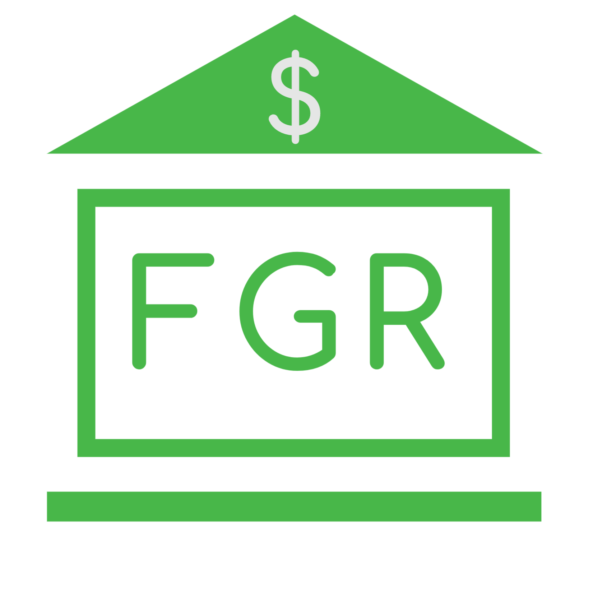

# FGR Budget Email Service

[](https://fgr-kubernetes-demo.northcentralus.cloudapp.azure.com)

This is the email service microservice used in the [Kubernetes Demo](https://frankieriviera.com/portfolio/kubernetes-demo) by [Frankie Riviera](https://frankieriviera.com)


# Develpment

## Getting Started

### Environment Variables

Example .env
```
SENDGRID_API_KEY=<SENDGRID_API_KEY>
EMAIL_VERIFICATION_SECRET=<EMAIL_VERIFICATION_SECRET>
SEND_EMAIL=false
```

**SENDGRID_API_KEY** API Key to from SendGrid to send emails. You can get this when you sign up for an account at https://sendgrid.com/

**EMAIL_VERIFICATION_SECRET** This is your custom secret that you would place would add here for when you want to send emails to verify someone has access to an email they claim authority over, You would also want this secret to exist on the app that finishes the verification process once the email is clicked.

**SEND_EMAIL** set to *true* for the SendGrid API to be triggered when email-service is used. If set to anything other then true, everything will work as expected, except emails will not be sent.

### Starting app
Once you have your .env file at the root of your project you can start up the email service for development with 
`docker-compose up`

---
### NOTE TO SELF When Developing with Windows 10 Home
Docker Toolbox does not play nice with docker-compose, so when I am developing with a windows 10 Home machine use the following cmds to start the email service like so...

`docker run -p 5500:5500 --name fgr_budget_email_service_web_1 --network budget --env-file .env -v /app/node_modules  -v /c/Users/frank/OneDrive/Development/02_Projects_In_Production/0027_PersonalBudgetApp/fgr_budget_email_service:/app dariv94/kubebud_email_service`
